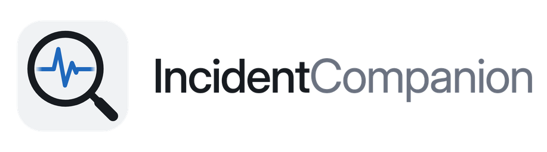

  <picture>
    <source media="(prefers-color-scheme: dark)" srcset="assets/wordmark-dark.png">
    
  </picture>

  A self-hosted workspace for security incident investigation and root-cause analysis. 
  <em>Because untangling an intrusion shouldn't mean fighting your own tools.</em>

  
  

---

## Coming soon

IncidentCompanion is in development and has not been released yet. This
repository holds the name, the brand and the license until version 1.0 lands
here.

When it does, you get a case workspace for SOC, MXDR and incident-response
analysts: the timeline, the affected machines, the accounts, the malware and
the evidence in one place, with the report produced from them rather than
written from memory at the end.

- **One case, one workspace.**
- **Two analysts, not one.** Edits appear on everyone's screen; a conflicting
  save asks rather than overwrites.
- **Evidence is hashed as you attach it**, and stays with the case.
- **Self-hosted.** Runs on your machine or your server. Nothing leaves it.

Watch this repository to hear when it ships.

## License

GNU Affero General Public License v3.0 only. See [LICENSE](LICENSE).
